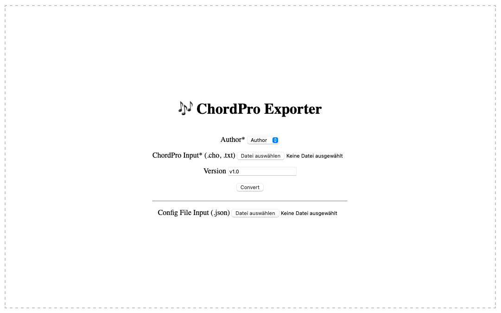

# 🎵 ChordPro-Exporter

This is a simple web-app for converting .cho files to PDF with a consistent format.



The app was built using Flask.

## 🏃Running

The app can be run with python or using the docker container.

### 🐍 Python

Either use python or python3.

```bash
python app.py
python3 app.py
```

### 🛳️ Docker

```bash
docker build . chordproexporter
docker run chordproexporter
```

In Docker Desktop, don't forget to assign a local port that is not in use.

## 💻 Usage

The default_configfile.json uses modern1 as the base style and adds a custom footer.
The ```users.json```file contains available users that can be selected. The corresponding initials will be printed in the footer text.

## CLI Usage

If you don't want to run the webserver, you can also run the CLI of the ```generate_meta.py``` script.  

### Generate-Meta

The Generate-Meta Script will search for a file called ```userconf.json``` which stores information about the current version of the file, if not found it will create one with default values.
This is useful, if you for example have a lot of folders for different songs and want to keep track of the current file version and author. You can store a ```userconf.json``` for each song and by running the script it will automatically update the version and date information.

The ```userconf.json``` has to look like this ([Example](example_userconf.json)):

```json
{
  "meta": {
    "initials": ["<INITIALS>"],
    "file_ver": ["v<MAJOR.MINOR>"],
    "create_time": ["<YYYY/MM"]
  }
}
```

```bash
python generate_meta.py
chordpro --config default_configfile.json <INPUT_FILE>
```

#### Options

- ```-m, --major``` Sets the version to the next major (e.g. ```v1.5 -> v2.0```)
- ```-i, --initials``` Sets the initials of the author
